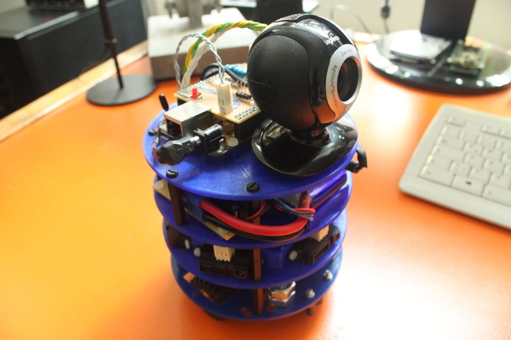

BeagleBot
=========

BeagleBot is a robot created as a demonstration platform to show how you can
build robotics software with the programming language Elixir and the Nerves
framework.

It uses a Beagle Bone Black, but you could replace it with any other
computing hardware that is supported by Nerves, for example a Raspberry Pi.

